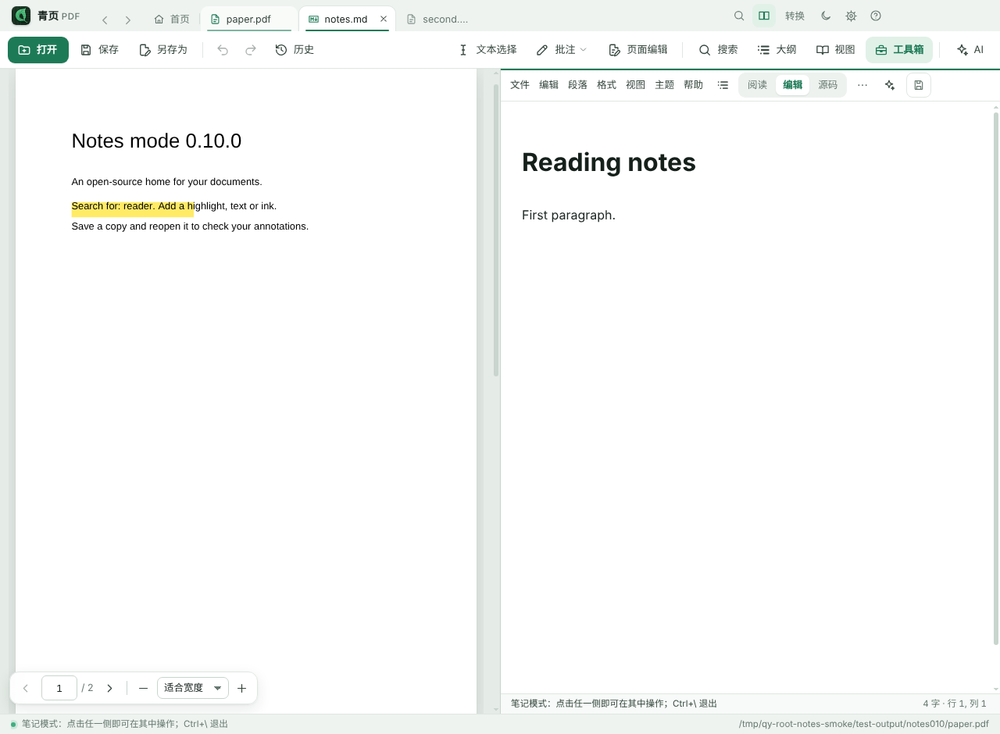
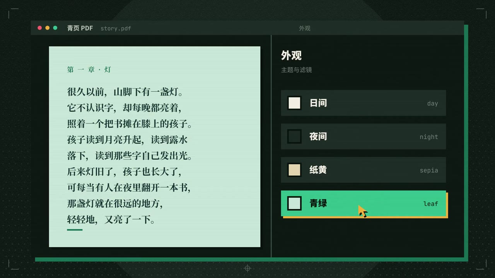
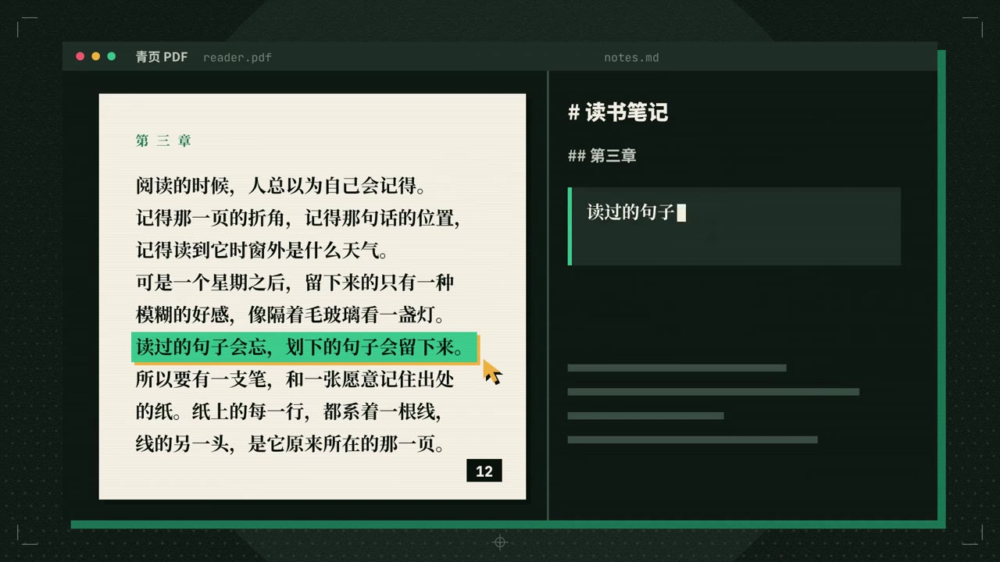
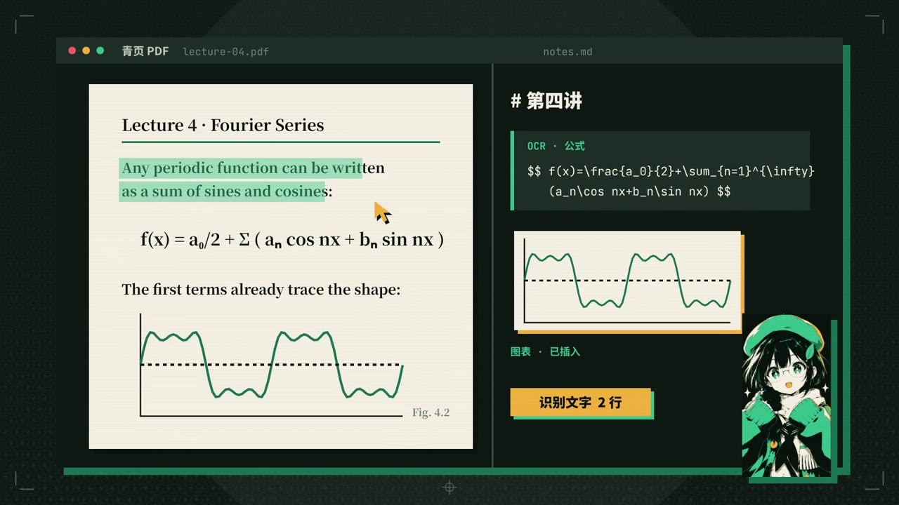
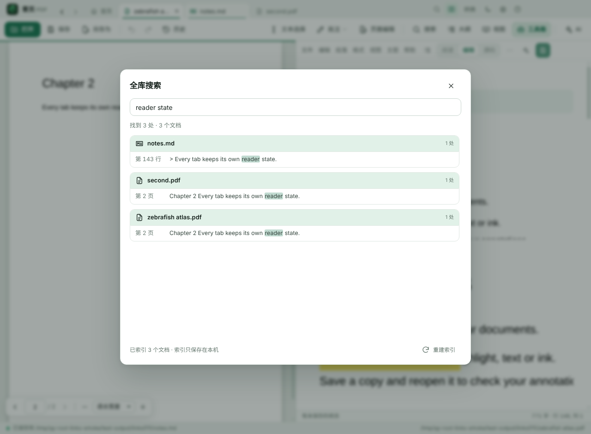
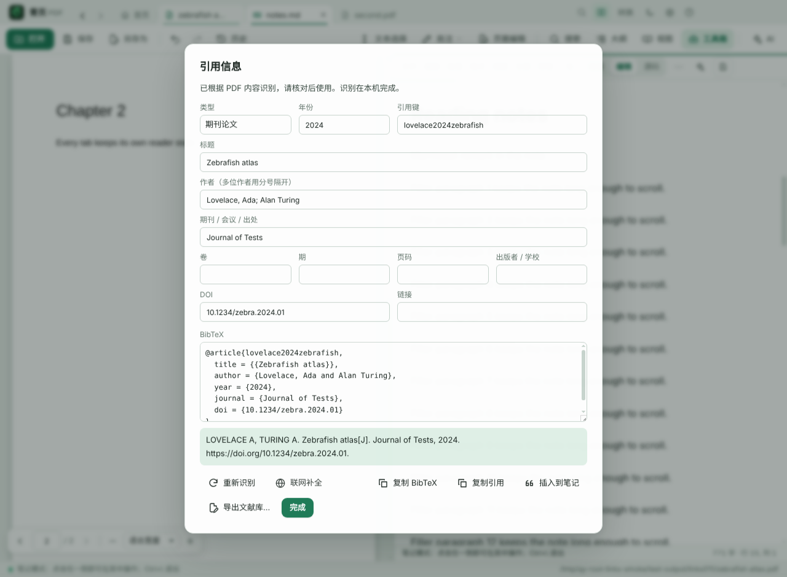

<p align="center"></p>
<h1 align="center">青页 PDF · Qingye PDF</h1>
<p align="center"><b>读 · 注 · 编 · 转 · 记——一份文档的全程，都在本机。</b></p>
<p align="center">本地优先的开源 PDF 工作台：阅读、批注、内容编辑、格式转换、Markdown 笔记、31 项文档工具，可选 AI 协作</p>
<p align="center"><i>Read, annotate, edit, convert, and take notes — a local-first, open-source PDF workbench with an optional AI assistant.<br>Windows · macOS · Linux · Android. AGPL-3.0.</i></p>

<p align="center"><a href="docs/media/QingyePDF-promo.mp4"></a></p>
<p align="center">▶ <a href="docs/media/QingyePDF-promo.mp4"><b>观看宣传片</b></a>（2 分钟 · 720p）</p>



## 这是什么

青页把一份文档的全部动作放进同一个窗口：读论文或书、划重点、改正文、调页面、转格式、摘录进 Markdown 笔记，两边互相知道对方在哪。所有文档处理都在本机完成，不上传文件，无账号、无订阅、无广告。

| | |
|---|---|
| **PDF 阅读** | 多标签、全文搜索、目录 / 书签 / 缩略图、高亮 / 墨迹 / 文本框 / 签名批注、并排比较阅读、文字重排 |
| **笔记模式** | PDF 与 Markdown 左右并排；摘录选中文字或框选区域（公式、图表），链接可回到原文并高亮；批注一键同步到笔记；翻页时笔记跟随 |
| **Markdown** | 所见即所得编辑（Typora 风格）、源码模式、数学公式、Mermaid 图表、表格、导出 PDF / Word / HTML / EPUB |
| **全库搜索** | 在所有打开过的 PDF 和笔记的内容里搜索，索引只保存在本机 |
| **引用信息** | 识别 DOI / arXiv / 标题 / 作者，生成 BibTeX、GB/T 7714、APA，导出 `.bib` 文献库 |
| **PDF 工具箱** | 7 大分类 31 项工具——页面（合并 / 拆分 / 重排 / 旋转 / 插入空白页）、导出与转换、编辑内容、印章与水印、安全（加密 / 永久涂黑）、扫描与优化（OCR，中英文）、比较 |
| **内容编辑** | 区域原文替换、创建文本与复选框表单、图形 / 印章 / 水印拖放缩放（不做原版式的逐字符改写） |
| **文档转换** | 内置官方 Pandoc，51 种输入 / 76 种输出格式（Word / EPUB / LaTeX / 网页…），三步转换中心，批量转换 |
| **AI 协作（可选）** | 连接你自己的模型服务（OpenAI 兼容、Anthropic、Ollama 等），AI 可读取两侧文档、写笔记、给 PDF 加批注；默认关闭 |
| **首页** | 经典 + 玻璃 / 版画格 / 桌面 / 色块四种可选首页；本机阅读活动（打开次数 / 阅读分钟 / 摘录数）、最近摘录一键回跳原文、`Ctrl+K` 快速启动 |
| **界面** | 套色印刷版画视觉，六套界面皮肤，五种首页样式，深绿双层框架 + 琥珀强调色，Windows 或 macOS 风格窗口，简体中文 / 繁體中文 / English / 日本語 / 한국어 |
| **平台** | Windows、macOS、Linux（AppImage / deb）、Android（手机竖屏时笔记模式上下分屏，轻点页面收起工具栏） |

### 一眼看懂

<table><tr>
<td width="33%"><br><b>读</b><br>多标签阅读，日间 / 夜间 / 纸黄 / 青绿四种阅读配色，同一本书随时换。</td>
<td width="33%"><br><b>摘</b><br>划下一句话，右边的笔记里就多一条带页码的摘录；点它，回到原文那一行。</td>
<td width="33%"><br><b>记</b><br>框选公式、图表或扫描页，识别成文字放进笔记。全部在本机完成。</td>
</tr></table>

### 0.14.0 → 0.17.0 新增

- **界面皮肤（0.17.0）**：经典、玻璃、版画格、桌面、色块、墨绿网点六套，换掉整个界面外壳的配色、圆角、线宽与字体；阅读区不受影响。
- **可选首页（0.16.0）**：玻璃、版画格、桌面、色块四种首页与经典并列，按本机记忆；首页显示阅读活动热力图、最近摘录与书签，非经典首页 `Ctrl+K` 打开命令面板。
- **工具入口重构（0.15.0）**：7 大分类 31 项工具统一编目，工具箱改为分类栏 + 工具卡片，PDF 工具栏与“全部工具”菜单直达每一项；文档转换中心改为三步。
- **套色印刷版画视觉（0.14.0）**：设计 token 体系、直角与错版第二层造型、内置 Noto Sans / Serif SC 与 JetBrains Mono 可变字体。

完整说明见 [docs/USER-GUIDE.md](docs/USER-GUIDE.md)，功能范围与限制见 [FEATURES.md](FEATURES.md)，各版本改动见 [CHANGELOG.md](CHANGELOG.md)。

<table><tr>
<td></td>
<td></td>
</tr></table>

## 下载

在仓库的 **Releases** 页面下载，四个平台当前版本均为 **0.17.0**：

| 系统 | 文件 | 说明 |
|---|---|---|
| Windows 10 / 11（x64） | `QingyePDF-<版本>-Setup-x64.exe` | NSIS 安装版 |
| Windows 10 / 11（x64） | `QingyePDF-<版本>-win-x64.exe` / `.zip` | 便携版，双击即用；第一次启动要把运行环境解压到本机，需要十几秒 |
| macOS 12+（Apple 芯片） | `QingyePDF-<版本>-mac-arm64.dmg` | 见 [docs/MACOS.md](docs/MACOS.md) |
| macOS 12+（Intel） | `QingyePDF-<版本>-mac-x64.dmg` | 同上 |
| Linux（x64） | `QingyePDF-<版本>-linux-x86_64.AppImage` / `-linux-amd64.deb` | 0.17.0 起提供 |
| Android 7+ | `QingyePDF-<版本>-android.apk`（仓库未配置签名密钥时是 `-android-debug.apk`） | 见 [mobile/README.md](mobile/README.md) |

四个平台共用阅读与笔记代码；Windows 0.17.0 另外提供界面皮肤和可选首页。界面里的快捷键提示在 Mac 上显示为 ⌘ / ⌥ 写法，在安卓上换成触屏手势。

发布的 Windows 和 macOS 版本目前没有付费的代码签名：Windows SmartScreen 会提示“未知发布者”（“更多信息 → 仍要运行”），macOS 第一次打开需要手动放行（步骤在 docs/MACOS.md）。可以用同目录的 `SHA256SUMS` 文件核对下载。配置签名的方法见 [docs/SIGNING.md](docs/SIGNING.md)。

## 从源码运行

需要 Node.js 22、Python 3.12（仅构建 PDF 工具箱后端时）。以下命令在 Windows PowerShell 中执行：

```powershell
git clone https://github.com/<你的用户名>/QingyePDF.git
cd QingyePDF
npm ci
node scripts/prepare-pdfjs.mjs      # 重新下载并校验 PDF.js（仓库已带一份，可跳过）
./scripts/prepare-pandoc.ps1        # 下载并校验 Pandoc 3.12（约 235 MB，不入库）
./scripts/build-backend.ps1         # 用 PyInstaller 冻结 PDF 工具箱后端（不入库）
npm start
```

只想改界面而不用工具箱和转换功能时，后两步可以跳过。在 macOS / Linux 上把两个 `.ps1` 换成 `bash scripts/prepare-pandoc.sh` 和 `bash scripts/build-backend.sh`。打包与发布见 [docs/BUILDING.md](docs/BUILDING.md)。

```powershell
npm test                            # 单元测试
node scripts/ci-smoke.cjs           # Electron 冒烟测试（真实窗口）
npm run dist                        # 生成 dist/QingyePDF-<版本>-win-x64.exe
```

## 仓库结构

```
main.cjs, preload.cjs      Electron 主进程与预加载脚本
*-ipc.cjs, *.cjs           主进程模块（Markdown、转换、AI、恢复、全库搜索索引…）
ui/                        界面（原生 ES 模块，无打包步骤）
  notes-mode.mjs           笔记模式
  library.mjs              全库搜索
  citation.mjs             引用信息
  markdown/                Markdown 编辑器
  ai/                      AI 面板与文档工具
  home/                    可选首页（玻璃 / 版画格 / 桌面 / 色块）
  tokens.css, skins.css    设计 token 与六套界面皮肤
backend/worker.py          PDF 工具箱（PyMuPDF），发布时冻结为 QingyeWorker
vendor/                    PDF.js、Markdown / 图表库、OCR 模型、内置字体（Pandoc 在构建时下载）
ui/platform-text.mjs       按平台改写界面文字（Mac 快捷键写法、安卓去掉键盘提示）
mobile/                    安卓版（Capacitor，复用 ui/）
test/                      单元测试与冒烟测试
scripts/                   构建、图标、翻译词典等脚本
docs/                      使用说明、构建说明、架构说明、历史文档
```

更多细节见 [docs/ARCHITECTURE.md](docs/ARCHITECTURE.md)。

## 隐私

- 不联网也能使用全部阅读、编辑、搜索和转换功能；应用的窗口进程禁止访问任何网络地址。
- 只有两处会在你明确操作时联网：**AI 协作**（把问题和模型读取的文档片段发送到你自己配置的服务）和**引用信息的“联网补全”**（只把 DOI 发送到 doi.org）。
- 最近文件、阅读位置、阅读活动、全库搜索索引、引用信息都保存在本机用户数据目录。

## 参与

欢迎提 Issue 和 Pull Request，请先看 [CONTRIBUTING.md](CONTRIBUTING.md)。

## 许可

[AGPL-3.0-only](LICENSE)。随附的第三方组件及其许可见 [THIRD_PARTY_NOTICES.md](THIRD_PARTY_NOTICES.md)；`LICENSE-MIT` 适用于其中注明的部分。
