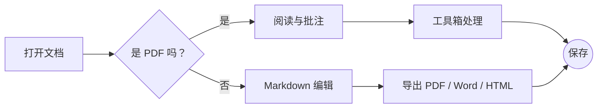
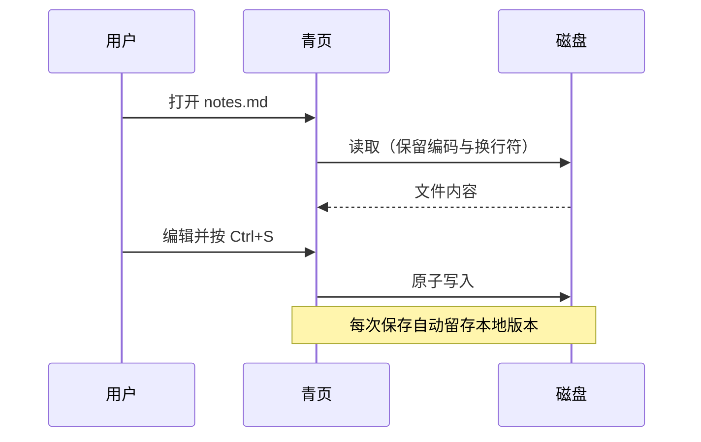
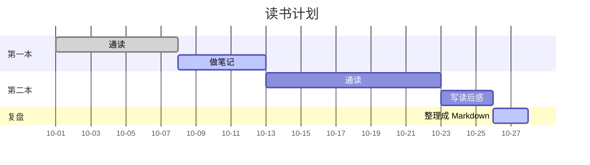
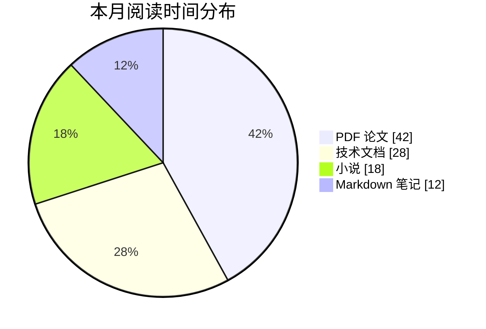
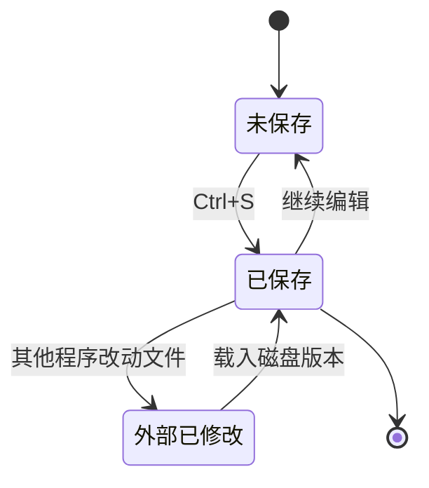
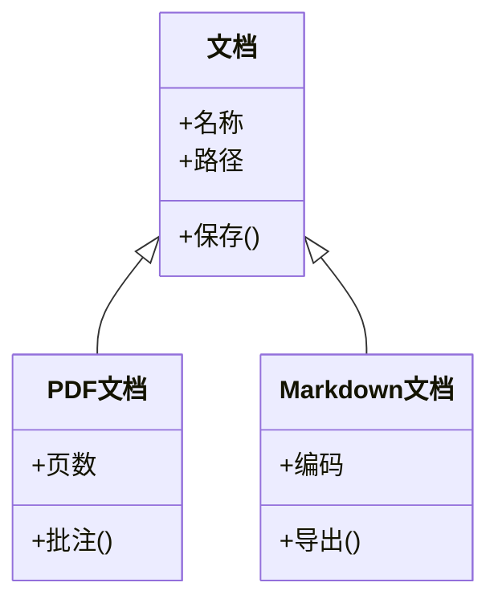
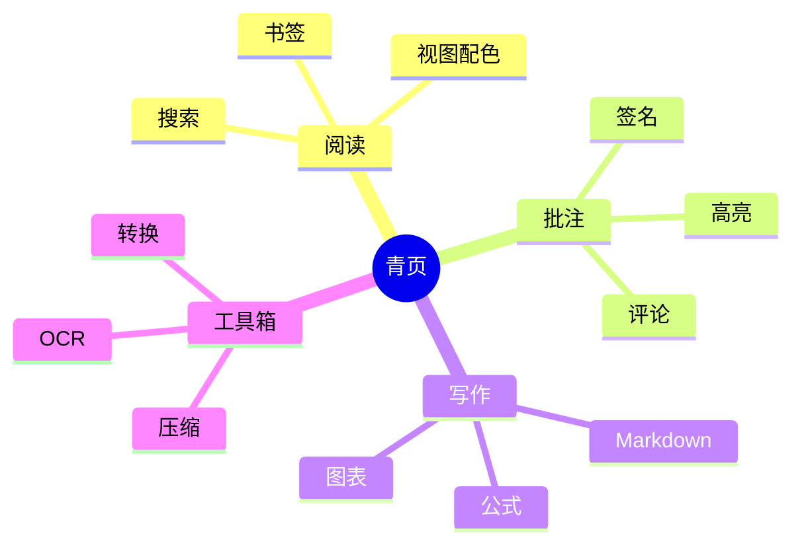
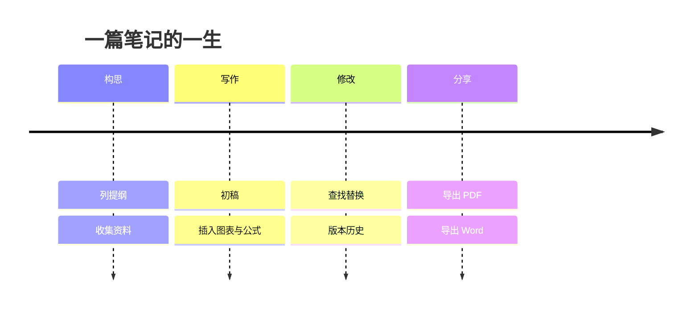
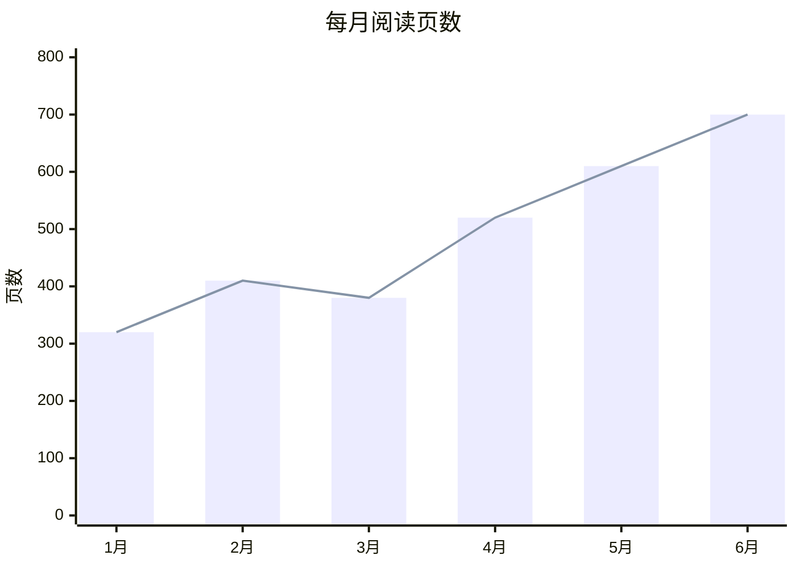

# 欢迎使用青页 Markdown

这是一份可以随意修改的示例文档。每一章介绍一类功能，并留出了可以直接动手的位置：点击段落编辑、勾选任务、改动表格、编辑图表源码……所有内容都只保存在你的电脑上，**不联网、不上传**。

> [!TIP]
> **动手试试**：随便改这份文档都没关系。它是一个未保存的新文档，关闭时选择“不保存”即可；想保留就按 `Ctrl + S` 另存为 `.md` 文件。

[TOC]

## 一、三种视图

右上角可以在三种视图之间切换，状态栏会提示当前所在的视图。

| 视图 | 适合 | 切换方式 |
| :--- | :--- | :--- |
| 阅读 | 只看排版好的文档，不会误改内容 | `Ctrl + Shift + R`；双击正文或按 `E` 回到编辑 |
| 编辑 | 所见即所得：点击段落即可编辑，光标所在块显示语法 | 单击“编辑” |
| 源码 | 纯文本编辑整篇 Markdown | `Ctrl + /` |

> [!NOTE]
> **动手试试**：切到“阅读”，看看这份文档的排版；再按 `E` 回到编辑。顶部那条细线是阅读进度。

## 二、文字与段落

支持 **加粗**、*斜体*、~~删除线~~、`行内代码`、==高亮==、<u>下划线</u>、H~2~O 下标、x^2^ 上标，以及 [链接](https://example.org "示例链接")——编辑时按住 Ctrl 单击打开，阅读模式下直接单击。也支持引用式链接：[青页][home]。

[home]: https://example.org/qingye

> 引用块适合摘录与说明。
>
> —— 可以包含多个段落

### 列表

- 无序列表项
- 另一项，可以包含 **格式**
  - 嵌套列表（`Tab` 缩进，`Shift + Tab` 取消缩进）

1. 有序列表
2. 在列表末尾按 Enter 继续，空项再按 Enter 退出列表

### 任务列表

- [x] 打开这份示例
- [ ] 单击复选框，把这一项标为完成
- [ ] 按 `Ctrl + S` 保存一份副本

> [!TIP]
> **动手试试**：点击本段，看看光标所在的块如何显示 Markdown 语法；再点其他地方，它会立即重新渲染。

## 三、表格

点击表格即可出现表格工具条：插入或删除行列、移动、对齐、调整大小。

| 季度 | 阅读页数 | 笔记条数 | 完成率 |
| :--- | ---: | ---: | :---: |
| 第一季度 | 1,240 | 86 | 72% |
| 第二季度 | 1,580 | 112 | 81% |
| 第三季度 | 1,910 | 135 | 88% |
| 第四季度 | 2,260 | 164 | 93% |

## 四、代码

代码块支持语法高亮，悬停右上角可以复制。

```python
def greet(name: str) -> str:
    """返回一句问候。"""
    return f"你好，{name}！"

print(greet("青页"))
```

```javascript
const tags = ['本地', '私密', '开源'];
console.log(tags.map(tag => `#${tag}`).join(' '));
```

## 五、数学公式

行内公式：质能方程 $E = mc^2$，以及 $\sum_{i=1}^{n} i = \frac{n(n+1)}{2}$。

$$
\int_{-\infty}^{\infty} e^{-x^2}\,dx = \sqrt{\pi}
$$

$$
\begin{aligned}
f(x) &= (x + 1)^2 \\
     &= x^2 + 2x + 1
\end{aligned}
$$

## 六、图表

用 ```` ```mermaid ```` 代码块画图，离线渲染、随浅色 / 深色主题配色，导出 HTML、PDF、Word 时一并输出。单击图表可以编辑源码，下方实时预览；过宽的图表会缩放到页面宽度，悬停可切换“原始大小”。

### 流程图



### 时序图



### 甘特图



### 饼图



### 状态图



### 类图



### 思维导图



### 时间线



### XY 图表



### Typora 风格的序列图与流程图

也支持 Typora 的 ```` ```sequence ```` 与 ```` ```flow ```` 写法：

```sequence
读者->青页: 打开示例
青页->读者: 渲染图表
Note right of 读者: 单击图表可编辑
```

```flow
st=>start: 开始
op=>operation: 编辑文档
cond=>condition: 满意吗？
e=>end: 保存
st->op->cond
cond(yes)->e
cond(no)->op
```

> [!TIP]
> **动手试试**：单击上面的饼图，把“小说”改成 30，看看下方的实时预览。

## 七、扩展语法

- 表情：输入 `:` 后按 Enter 补全，例如 :smile: :rocket: :tada: :books:
- 脚注：这里有一个脚注[^note]，定义会随文档末尾自动编号。
- 注释：下面有一条 HTML 注释，编辑视图显示为一行淡色标记，阅读视图完全隐藏。

<!-- 这是一条注释，渲染时隐藏 -->

GitHub 风格的警告框共五种：

> [!NOTE]
> 注意：补充说明。

> [!TIP]
> 提示：更好的做法。

> [!IMPORTANT]
> 重要：必须知道的信息。

> [!WARNING]
> 警告：可能出问题的地方。

> [!CAUTION]
> 小心：可能造成损失的操作。

[^note]: 脚注的内容写在这里。

## 八、导出与分享

“文件 → 导出”支持 PDF、HTML、Word（.docx）、ePub、LaTeX、RTF、纯文本和 PNG 长图；内置转换引擎还可以导出 ODT、RST、PPTX 等格式，并从 Word、HTML 等导入。首页与标题栏的“文档转换”提供更多输入输出格式、模板、引用样式和过滤器。

> [!TIP]
> **动手试试**：用“文件 → 导出 → Word”导出这份示例，看看公式、表格和图表在 Word 中的样子。

## 附录：常用快捷键

| 快捷键 | 作用 |
| :--- | :--- |
| `Ctrl + B` / `Ctrl + I` | 加粗 / 斜体 |
| `Ctrl + 1` … `Ctrl + 6` | 一至六级标题 |
| `Ctrl + K` | 插入链接 |
| `Ctrl + T` | 插入表格 |
| `Ctrl + Shift + K` | 代码块 |
| `Ctrl + Shift + M` | 公式块 |
| `Ctrl + F` / `Ctrl + H` | 查找 / 替换 |
| `Ctrl + Shift + P` | 命令面板（可搜索全部命令） |
| `Ctrl + P` | 快速打开文件 |
| `F8` / `F9` | 专注模式 / 打字机模式 |
